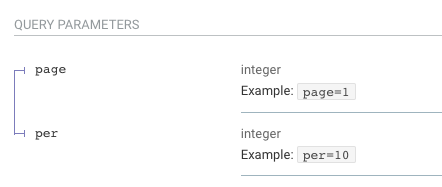
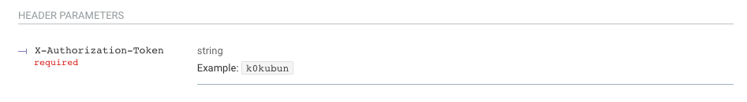
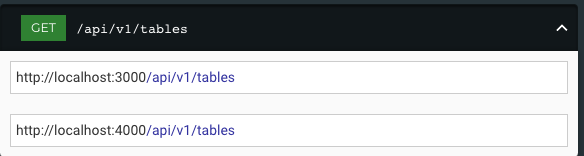
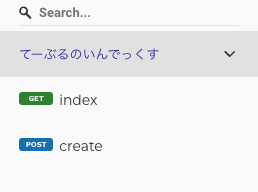

## rspec-open-api
  - https://github.com/exoego/rspec-openapi#example
    - request specからAPIドキュメントを作成できる
    - 記述方法はgemの説明を見ればわかるが、例としてspec例を書いてくれているので、それを参考にすればある程度はわかるが、部分的にどうすればいいかわからない箇所があるため備忘録としてREADMEに書いておく
    - APIドキュメント

### 記述例
```ruby
RSpec.describe 'Tables', type: :request do
  describe '#index' do
    it 'returns a list of tables' do
      get '/tables', params: { page: '1', per: '10' }, headers: { authorization: 'k0kubun' }
      expect(response.status).to eq(200)
    end

    it 'does not return tables if unauthorized' do
      get '/tables'
      expect(response.status).to eq(401)
    end
  end

  # ...
end
```
#### query parameter
- 上記の例で説明していくと、spec内の`params`が設定されていると、下記添付画像のようにquery parameterとして表示される。


#### headers
- 例では`headers`を設定しているが、このままではAPIドキュメントの方には反映されないため、rspec-openapiのオプションで
  `RSpec::OpenAPI.request_headers = %w[X-Authorization-Token]`を設定してあげるひつようがある。このrequest_headersで指定しているkeyと同じものをrequest specで指定して初めて添付画像のようにドキュメントに反映される。

  つまり今回で言うと、
  ```ruby
  it 'returns a list of tables' do
    get '/tables', params: { page: '1', per: '10' }, headers: { 'X-Authorization-Token': 'k0kubun' }
    expect(response.status).to eq(200)
  end
  ```
  といった形にheadersのkeyを変更する必要がある。

#### リクエストURL
- リクエストのURL先はどこかの設定はrspec-openapiのオプションで指定可能。
  具体的には下記のようにserversを指定することで可能。
  ```ruby
  RSpec::OpenAPI.servers = [
    { url: 'http://localhost:3000' },
    { url: 'http://localhost:4000' }
  ]
  ```
  上記のように複数指定すると、  
    
  複数のリクエスト先が確認できるので、stagingと本番で分けている場合などは複数指定することで混乱を避けれるが、stagingと本番はAPIの仕様がリリースタイミングによって変わることが多いので、そもそも生成するhtml自体を分ける方が良いかもしれない。

#### tags
- tagsを設定することで、それぞれのグルーピングをすることができる。また、グルーピングをすることでサイドバーで検索、やアンカーが設定できる。  

